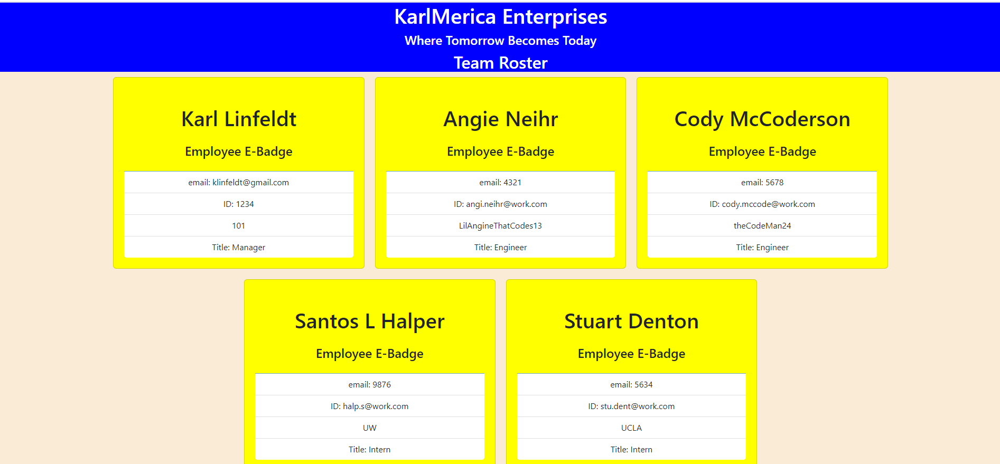
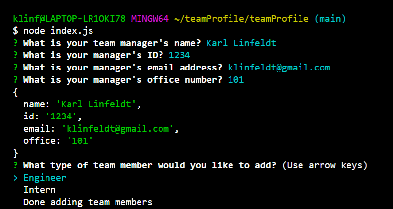
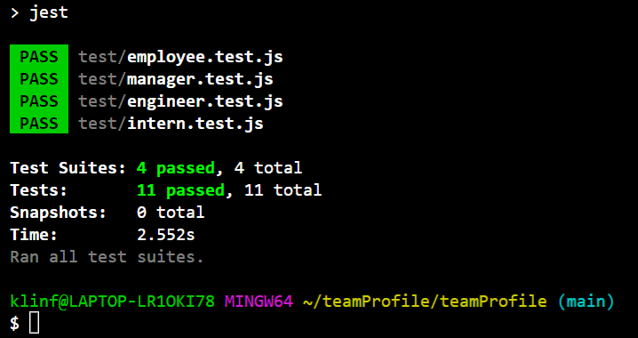

  # Team Roster Generator

  ## Contents
  -Contact  
  -Overview  
  -Installation  
  -User Instructions  
  -License(s)  

  ## Developer Contact
  -klinfeldt@gmail.com  
  -KarlOL82@github.com
  -[Repo](https://github.com/KarlOL82/teamProfile)

  ## Overview
  This application takes user input and creates html employee cards with basic team member information. The app runs Inquirer in node.js powered by Javascript.

  ## Installation
  This app requires node.js, inquirer, and FS. The test files during development were powered by Jest.

  ## Usage
  Run the index.js file in the node CLI and answer the questions as prompted. After each employee card is generated, you will have the option to continue adding more team members or choose done to create your generated html file and complete the question loop.

  ## License
    
  https://opensource.org/licenses/MIT
  
  ## MIT
   
 "This application is using license MIT." 

 ## Photos
   
   
 

 

    
  